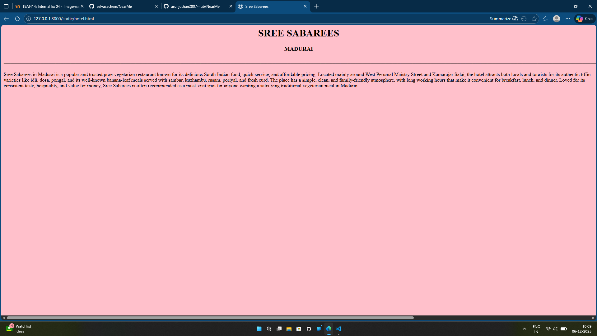
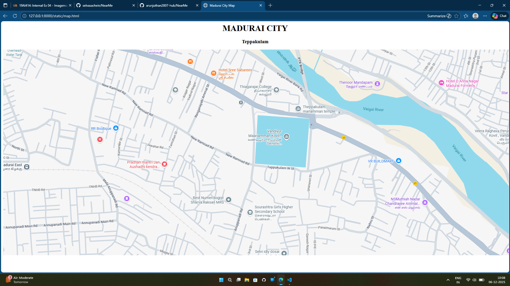
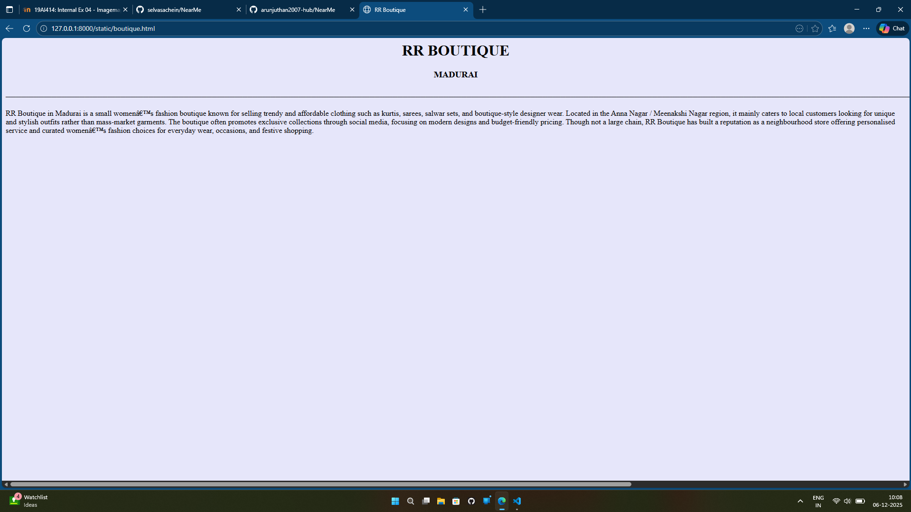
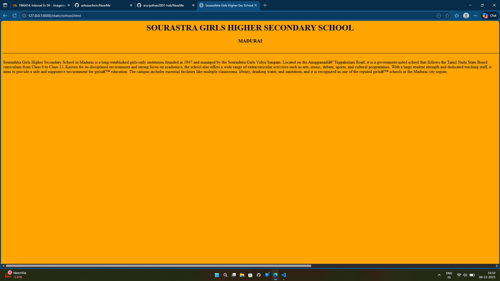
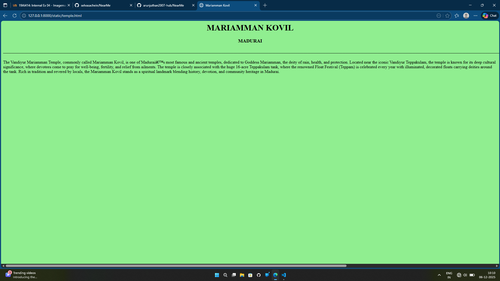

# Ex03 Places Around Me
## Date: 

## AIM
To develop a website to display details about the places around my house.

## DESIGN STEPS

### STEP 1
Create a Django admin interface.

### STEP 2
Download your city map from Google as an image.

### STEP 3
Insert the image using `````` tag and link it to the map.

### STEP 4
Using ```<map>``` tag name the map.

### STEP 5
Create clickable regions in the image using ```<area>``` tag.

### STEP 6
Write HTML programs for all the regions identified.

### STEP 7
Execute the programs and publish them.

## CODE
```
boutique.html
<html>
    <head>
        <title>RR Boutique

        </title>
    </head>
    <body bgcolor="lavender">
        <h1 align="center">RR BOUTIQUE</h1>
        <h3 align="center">MADURAI</h3>
        <h6>______________________________________________________________________________________________________________________________________________________________________________________________________________________________________________________________________________________________________________________________________________________________________________________________________________________________________________________________________________________________________________________________</h6>
        <p>RR Boutique in Madurai is a small women’s fashion boutique known for selling trendy and affordable clothing such as kurtis, sarees, salwar sets, and boutique-style designer wear. Located in the Anna Nagar / Meenakshi Nagar region, it mainly caters to local customers looking for unique and stylish outfits rather than mass-market garments. The boutique often promotes exclusive collections through social media, focusing on modern designs and budget-friendly pricing. Though not a large chain, RR Boutique has built a reputation as a neighbourhood store offering personalised service and curated women’s fashion choices for everyday wear, occasions, and festive shopping.</p>
    </body>
</html>

hotel.html
<html>
    <head>
        <title>Sree Sabarees

        </title>
    </head>
    <body bgcolor="pink">
        <h1 align="center">SREE SABAREES</h1>
        <h3 align="center">MADURAI</h3>
        <h6>______________________________________________________________________________________________________________________________________________________________________________________________________________________________________________________________________________________________________________________________________________________________________________________________________________________________________________________________________________________________________________________________</h6>
        <p>Sree Sabarees in Madurai is a popular and trusted pure-vegetarian restaurant known for its delicious South Indian food, quick service, and affordable pricing. Located mainly around West Perumal Maistry Street and Kamarajar Salai, the hotel attracts both locals and tourists for its authentic tiffin varieties like idli, dosa, pongal, and its well-known banana-leaf meals served with sambar, kuzhambu, rasam, poriyal, and fresh curd. The place has a simple, clean, and family-friendly atmosphere, with long working hours that make it convenient for breakfast, lunch, and dinner. Loved for its consistent taste, hospitality, and value for money, Sree Sabarees is often recommended as a must-visit spot for anyone wanting a satisfying traditional vegetarian meal in Madurai.</p>
    </body>
</html>

map.html
<html>
    <head>
        <title>Madurai City Map</title>
    </head>
    <body align="center">
        <h1 >MADURAI CITY</h1>
        
        <h3>Teppakulam</h3>
        

            <map name="image-map">
                <area target="" alt="Vaigai River" title="Vaigai River" href="river.html" coords="1019,0,1035,93,1074,42,1129,83,1092,133,1123,153,1192,145,1212,195,1324,218,1389,213,1187,173,1271,217,1394,175,1734,386,1408,188,1519,180,1394,274,1593,259,1346,249,1574,284,1694,412,1290,200,1778,474,1826,546,1840,544,1879,526,1890,576,1857,616,1838,487,1877,677,1778,422,1768,561,1789,524,1705,324,1243,173,1677,309,1215,139" shape="poly">
                <area target="" alt="Mariamman Kovil" title="Mariamman Kovil" href="temple.html" coords="1141,446,956,254" shape="rect">
                <area target="" alt="Sourashtra Girls Higher Sec School" title="Sourashtra Girls Higher Sec School" href="school.html" coords="929,627,19" shape="circle">
                <area target="" alt="Sree Sabarees" title="Sree Sabarees" href="hotel.html" coords="786,84,801,97" shape="rect">
                <area target="" alt="RR Boutique" title="RR Boutique" href="boutique.html" coords="423,294,21" shape="circle">
            </map>
        


    </body>
</html>


river.html
<html>
    <head>
        <title>Vaigai river</title>
    </head>
    <body align="center" bgcolor="cyan">
        <h1 >VAIGAI RIVER</h1>
        
        <h3>MADURAI</h3>
        <h6>______________________________________________________________________________________________________________________________________________________________________________________________________________________________________________________________________________________________________________________________________________________________________________________________________________________________________________________________________________________________________________________________________________________________________________________________________________________________________________________________________________________________________________________________________________________</h6>
        <p>The Vaigai River is an important river in Tamil Nadu and is often called the lifeline of Madurai. It originates from the Varusanadu Hills of the Western Ghats in Theni district and flows for about 258 km through the districts of Theni, Dindigul, Madurai, Sivagangai, and Ramanathapuram before emptying into the Palk Strait. The river receives water from several tributaries like the Suruli, Manjalar, Varaha, and Mullaiyaaru rivers. The famous Vaigai Dam, built across the river near Andipatti, supports irrigation and drinking water supply for many southern districts. Madurai city is historically and culturally connected with the Vaigai, and it is mentioned in ancient Sangam literature as “Vaiyai”. Though the river is seasonal and often dries during summer, it remains vital for agriculture, festivals, and the daily lives of the people living along its banks.</p>
</html>
school.html
<html>
    <head>
        <title>Sourashtra Girls Higher Sec School

        </title>
    </head>
    <body bgcolor="orange">
        <h1 align="center">SOURASTRA GIRLS HIGHER SECONDARY SCHOOL</h1>
        <h3 align="center">MADURAI</h3>
        <h6>_________________________________________________________________________________________________________________________________________________________________________________________________________________________________________________________________________________________________________________________________________________________________________________________________________________________________________________________________________________________________________________________________________________________________________________________</h6>
        <p>Sourashtra Girls Higher Secondary School in Madurai is a long-established girls-only institution founded in 1947 and managed by the Sourashtra Girls Vidya Sangam. Located on the Anuppanadi–Teppakulam Road, it is a government-aided school that follows the Tamil Nadu State Board curriculum from Class 6 to Class 12. Known for its disciplined environment and strong focus on academics, the school also offers a wide range of extracurricular activities such as arts, music, debate, sports, and cultural programmes. With a large student strength and dedicated teaching staff, it aims to provide a safe and supportive environment for girls’ education. The campus includes essential facilities like multiple classrooms, library, drinking water, and sanitation, and it is recognized as one of the reputed girls’ schools in the Madurai city region.</p>
    </body>
</html>

temple.html
<html>
    <head>
        <title>Mariamman Kovil

        </title>
    </head>
    <body bgcolor="lightgreen">
        <h1 align="center">MARIAMMAN KOVIL</h1>
        <h3 align="center">MADURAI</h3>
        <h6>______________________________________________________________________________________________________________________________________________________________________________________________________________________________________________________________________________________________________________________________________________________________________________________________________________________________________________________________________________________________________________________________</h6>
        <p>The Vandiyur Mariamman Temple, commonly called Mariamman Kovil, is one of Madurai’s most famous and ancient temples, dedicated to Goddess Mariamman, the deity of rain, health, and protection. Located near the iconic Vandiyur Teppakulam, the temple is known for its deep cultural significance, where devotees come to pray for well-being, fertility, and relief from ailments. The temple is closely associated with the huge 16-acre Teppakulam tank, where the renowned Float Festival (Teppam) is celebrated every year with illuminated, decorated floats carrying deities around the tank. Rich in tradition and revered by locals, the Mariamman Kovil stands as a spiritual landmark blending history, devotion, and community heritage in Madurai.</p>
    </body>
</html>
```


## OUTPUT
map.html



boutique.html



hotel.html


river.html


school.html


temple.html


## RESULT
The program for implementing image maps using HTML is executed successfully.
